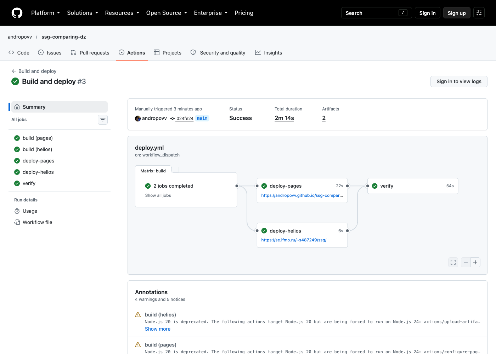
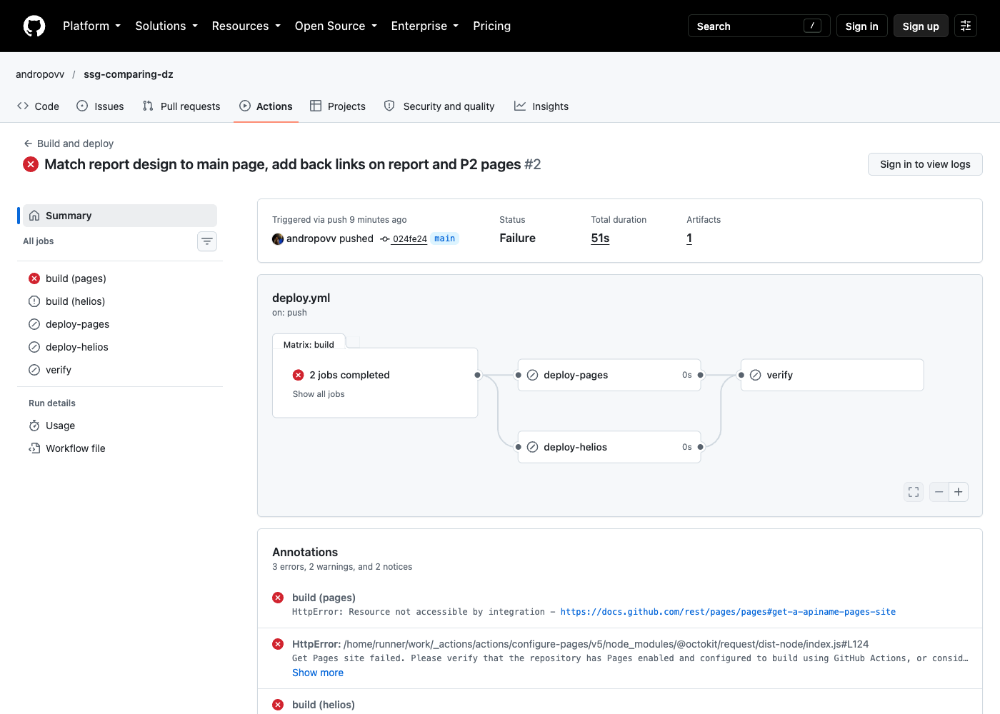
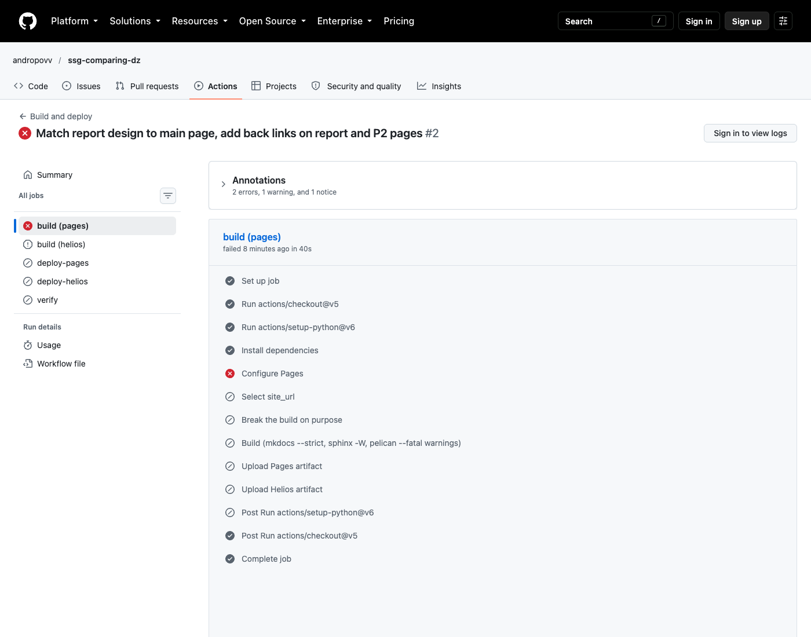

# CI/CD и развёртывание

## Схема пайплайна

```text
push в main ─┬─ build (pages)  ── SITE_URL = https://andropovv.github.io/ssg-comparing-dz/ ── upload-pages-artifact ── deploy-pages ──┐
             └─ build (helios) ── SITE_URL = https://se.ifmo.ru/~s487249/ssg/ ── upload-artifact ── deploy-helios (rsync) ─┴─ verify
pull_request ── build (pages, helios) — только сборка в строгом режиме, без деплоя
workflow_dispatch(break_build=true) ── вставляет битую ссылку → build падает (для скриншота проваленного запуска)
```

Каждая сборка запускает три генератора в строгом режиме: `mkdocs build --strict`,
`sphinx-build -W --keep-going`, `pelican --fatal warnings`. Любое предупреждение (битая ссылка,
неизвестная метка, лишний символ в grid-таблице) роняет пайплайн до деплоя.

## Текст workflow

Основа — стартовый workflow GitHub «Static HTML» (Settings → Pages → Build and deployment →
Source: **GitHub Actions** → Static HTML). Это и есть подсказка из задания: шаблон даёт связку
`configure-pages → upload-pages-artifact → deploy-pages`, а к ней добавлены сборка генераторами,
отдельный артефакт для Helios, деплой по SSH и проверка.

```yaml title=".github/workflows/deploy.yml"
--8<-- ".github/workflows/deploy.yml"
```

Скрипт сборки, общий для CI и локальной работы:

```bash title="scripts/build_all.sh"
--8<-- "scripts/build_all.sh"
```

## Два способа публикации на GitHub Pages

| | Ветка `gh-pages` (peaceiris/actions-gh-pages, `mkdocs gh-deploy`) | Артефакт (actions/upload-pages-artifact + actions/deploy-pages) |
|---|---|---|
| Что публикуется | Коммит в отдельную ветку; Pages раздаёт её содержимое | Tar-архив артефакта workflow; ветки нет |
| Настройка Pages | Source: Deploy from a branch → `gh-pages` | Source: GitHub Actions |
| Права токена | `contents: write`: workflow может писать в репозиторий | `pages: write` + `id-token: write` (OIDC), запись в репозиторий не нужна |
| История | Каждый деплой — коммит; откат через `git revert` в `gh-pages`; репозиторий растёт от бинарных файлов | История — в Deployments; откат — перезапуск старого workflow |
| Защита | Любой с правом push в `gh-pages` может опубликовать что угодно | Окружение `github-pages` с правилами защиты (только `main`, ручное подтверждение) |
| Jekyll | Нужен `.nojekyll`, иначе каталоги с `_` (`_static` у Sphinx!) не отдаются | Jekyll не запускается |
| Когда выбирать | Нужно видеть собранный сайт в git или деплоить из стороннего CI без OIDC | По умолчанию для GitHub Actions — используется здесь |

Подводный камень Sphinx при публикации через ветку: без `.nojekyll` GitHub Pages прогоняет ветку
через Jekyll, и тот выбрасывает `_static/` и `_images/`, то есть сайт остаётся без CSS и картинок.
Публикация артефактом этой проблемы лишена.

## Развёртывание на Helios

Helios — общий сервер кафедры (FreeBSD 14.5). nginx отдаёт `~/public_html` пользователя по адресу
`https://se.ifmo.ru/~sXXXXXX/`, SSH — на порту 2222.

| Шаг | Как сделано |
|---|---|
| Доступ из CI | Отдельный ключ ed25519 `github-actions-deploy-helios`. Публичная часть — в `~/.ssh/authorized_keys` на Helios, приватная — в секрете `HELIOS_SSH_KEY`. Пароль от Helios в CI не хранится |
| Проверка сервера | Ключ хоста закреплён в `.github/helios_known_hosts` (получен `ssh-keyscan -p 2222`); `StrictHostKeyChecking` по умолчанию: при подмене сервера деплой упадёт |
| Изоляция | Деплой в `~/public_html/ssg/`; `rsync --delete` работает только внутри этого каталога, лабораторные `lab1`–`lab3` в корне `public_html` не затрагиваются |
| Права | nginx читает файлы от другого пользователя: каталоги 755, файлы 644. Без этого — 403 |
| Базовый URL | Отдельная сборка с `SITE_URL=https://se.ifmo.ru/~s487249/ssg/`: от него зависят `canonical`, `sitemap.xml` и абсолютные пути в `404.html` |

### Базовый URL: что ломается в подкаталоге

| Параметр | Значение | Что ломается при ошибке |
|---|---|---|
| `site_url` (MkDocs) | Своё для каждой площадки | `404.html` ссылается на `/ssg-comparing-dz/assets/...` — на Helios без стилей; неверные `canonical` и `sitemap.xml` |
| `use_directory_urls: true` | `/setup/` → `setup/index.html` | Ничего: и GitHub Pages, и nginx отдают `index.html` для каталога. При открытии через `file://` ссылки на каталоги не работают — тогда нужен `false` |
| Относительные ссылки в теле страниц | MkDocs делает их относительными сам | Абсолютные `/assets/...` в ручном HTML вели бы в корень `se.ifmo.ru` |
| `RELATIVE_URLS = True` (Pelican) | Все ссылки темы относительные | Без него `SITEURL = ""` даёт пути от корня домена |
| Sphinx | Всегда относительные пути | — |

## Проверка развёртывания

`scripts/check_site.py` запускается в CI после деплоя для обеих площадок:

1. HTTP 200 для отчёта и трёх страниц P2.
2. Контрольные строки `LAB1-SSG-REPORT-OK` и `P2-STRESS-PAGE-OK`: защита от ситуации «200, но не та
   страница».
3. Поисковые индексы доступны и содержат русские слова: `отладка` в индексе lunr, основа
   `затухан` в индексе Sphinx.
4. В `<script src>` и `<link href>` нет внешних хостов.
5. **Формулы без CDN:** headless Chrome запускается с `--host-resolver-rules="MAP * ~NOTFOUND,
   EXCLUDE se.ifmo.ru"`, то есть все хосты, кроме проверяемого, не резолвятся. Затем в DOM
   считаются элементы `<mjx-container>`.

Результат на Helios:

```text
--8<-- "_generated/check-helios.txt"
```

## Время развёртывания

### В CI (GitHub Actions, запуск #3)

Данные взяты из API GitHub (`/actions/runs/37918009188/jobs`): время начала и конца каждого шага.

| Джоб | Всего, с | Ключевые шаги |
|---|---:|---|
| build (pages) | 45 | установка зависимостей 26 с, сборка трёх генераторов 4 с, загрузка артефакта 3 с |
| build (helios) | 43 | установка зависимостей 24 с, сборка 5 с, загрузка артефакта 3 с |
| deploy-pages | 22 | `actions/deploy-pages` — 18 с (ожидание публикации на CDN GitHub) |
| deploy-helios | 6 | `rsync` по SSH с раннера GitHub на Helios — 2 с |
| verify | 54 | проверка Pages 31 с, проверка Helios 19 с (больше всего времени — headless Chrome) |
| **Весь запуск** | **134** | две сборки идут параллельно, деплои тоже параллельно |

Узкое место — установка 80 пакетов из `requirements.txt` (около 60 % времени сборки), а не сами
генераторы. Кэш pip в `setup-python` экономит загрузку колёс, но не установку.

### С рабочей машины на Helios (rsync)

--8<-- "_generated/deploy.md"

## Запуски CI

### Успешный запуск

[Build and deploy #3](https://github.com/andropovv/ssg-comparing-dz/actions/runs/37918009188),
запущен вручную (`workflow_dispatch`) после включения Pages и добавления секрета:



### Проваленный запуск

[Build and deploy #2](https://github.com/andropovv/ssg-comparing-dz/actions/runs/37917473610):
первый push, сделанный, пока репозиторий был приватным и Pages не были включены.





Текст ошибки из аннотаций запуска:

```text
HttpError: Resource not accessible by integration - https://docs.github.com/rest/pages/pages#get-a-apiname-pages-site
Get Pages site failed. Please verify that the repository has Pages enabled and configured to build
using GitHub Actions, or consider exploring the `enablement` parameter for this action.
The strategy configuration was canceled because "build.pages" failed
```

Разбор — в [Отладке](debugging.md). Ошибку можно воспроизвести и намеренно, через
Actions → Run workflow → `break_build: true`: в `docs/index.md` добавляется битая ссылка, и
`mkdocs build --strict` падает:

```text
WARNING -  Doc file 'index.md' contains a link 'no-such-page.md', but the target is not found among documentation files.
Aborted with 1 warnings in strict mode!
```

### Предупреждения в успешном запуске

| Аннотация | Что значит | Что сделать |
|---|---|---|
| `Node.js 20 is deprecated … actions/upload-artifact@v4`, `actions/configure-pages@v5` | Эти версии actions собраны под Node 20, раннер запускает их на Node 24 принудительно | Обновить до версий под Node 24 (на 09.10.2026: `upload-artifact@v7`, `configure-pages@v6`, `deploy-pages@v5`, `upload-pages-artifact@v5`, `download-artifact@v8`, `checkout@v7`, `setup-python@v7`) после чтения их changelog |
| `The ubuntu-latest label will migrate to Ubuntu 26 beginning October 19, 2026` | Образ раннера сменится | Для воспроизводимости закрепить `runs-on: ubuntu-24.04` |
