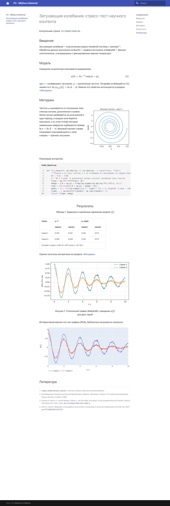
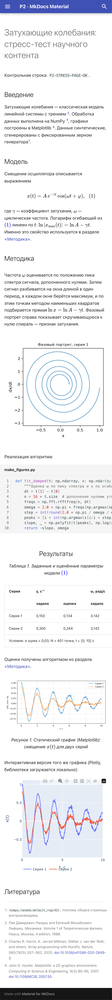
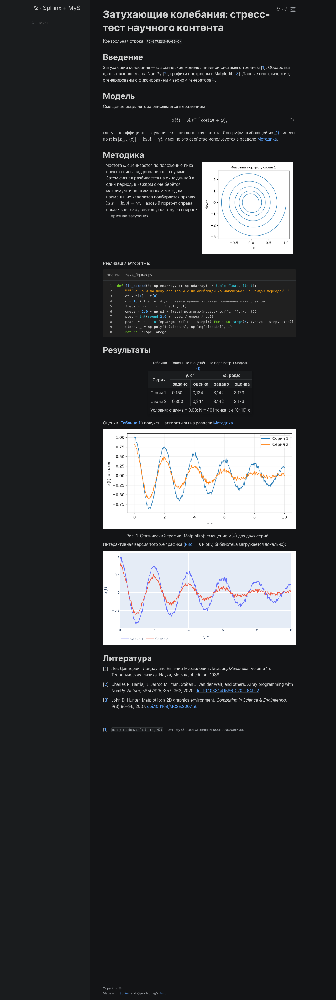
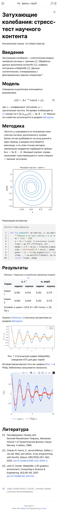
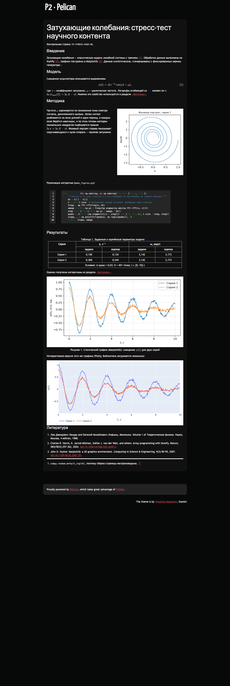
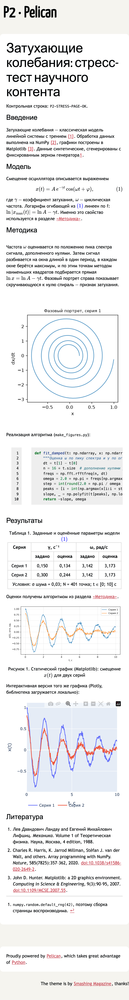

# P2. Страница — стресс-тест научного контента

Одна и та же страница о затухающих колебаниях свёрстана на трёх генераторах из [T1](t1.md).
Данные синтетические (`numpy`, seed 42). Графики, CSV, фрагмент Plotly и `.bib` — общие для всех
трёх: их генерирует `p2/shared/make_figures.py`.

| Генератор | GitHub Pages | Helios | Исходник |
|---|---|---|---|
| MkDocs Material | [p2/mkdocs/](mkdocs/) | [se.ifmo.ru/~s487249/ssg/p2/mkdocs/](https://se.ifmo.ru/~s487249/ssg/p2/mkdocs/) | `p2/mkdocs/docs/index.md` |
| Sphinx + MyST | [p2/sphinx/](sphinx/) | [se.ifmo.ru/~s487249/ssg/p2/sphinx/](https://se.ifmo.ru/~s487249/ssg/p2/sphinx/) | `p2/sphinx/index.md` |
| Pelican | [p2/pelican/](pelican/) | [se.ifmo.ru/~s487249/ssg/p2/pelican/](https://se.ifmo.ru/~s487249/ssg/p2/pelican/) | `p2/pelican/content/pages/stress.md` |

## Что и какой ценой реализовано

| Элемент | MkDocs Material | Sphinx + MyST | Pelican |
|---|---|---|---|
| Нумерованная формула и ссылка на неё | MathJax `tags: 'ams'`, `\label` / `\eqref`; номер ставится на клиенте | ✅ `$$ … $$ (eq-oscillator)` + `{eq}`; номер ставится при сборке | MathJax через переопределение шаблона, как в MkDocs |
| Таблица с объединёнными ячейками и подписью | ⚠️ **Ручной HTML**: в Markdown нет `rowspan`/`colspan`; подпись с автономером — `/// table-caption` | ✅ Grid-таблица rST в `{eval-rst}` + `.. table::` с `:name:`, ссылка `{numref}`; ширину столбцов приходится выравнивать посимвольно | ⚠️ **Ручной HTML**, номер «Таблица 1» вписан руками |
| Статический график (matplotlib) | `` + `/// figure-caption` (автономер) | ✅ `{figure}` + `numfig` («Рис. 1.») + ссылка `{numref}` | ⚠️ **Ручной `<figure>`**, номер руками |
| Интерактивный график (Plotly) | Фрагмент через `pymdownx.snippets` + локальный `plotly.min.js` в `extra_javascript` | `{raw} html :file:` + `html_js_files` | Фрагмент через `pymdownx.snippets` + `<script defer>` в шаблоне |
| Листинг с подсветкой и номерами строк | ✅ `linenums="1"`, заголовок `title=` | ✅ `{code-block}` `:linenos:` `:caption:` («Листинг 1.») | ✅ `codehilite` с `linenums` |
| Цитирование из `.bib` и список литературы | ⚠️ Плагин **mkdocs-bibtex**: источники попадают в общий список вместе со сносками и нумеруются вперемешку | ✅ sphinxcontrib-bibtex, `{cite:p}`, стиль `unsrt` | ❌ Поддерживаемого плагина нет → **свой плагин** `plugins/bibcite` (40 строк на pybtex) |
| Двухколоночный блок | ✅ `
` (нужен `md_in_html`) | ✅ `{grid} 1 1 2 2` из sphinx-design | ⚠️ **Свой CSS grid** + `@media` в переопределённом шаблоне |
| Сноска | ✅ `footnotes` | ✅ MyST `[^seed]` | ✅ `extra` |
| Перекрёстная ссылка на раздел | Якорь `{#method}`, текст ссылки пишется руками | ✅ `(method)=` + `{ref}`: текст подставляется из заголовка | Якорь `{#method}`, текст руками |
| Формулы без CDN | `tex-svg.js` в `extra_javascript` | `mathjax_path = "tex-svg.js"` из `_static` | `<script>` в шаблоне |

**Чего не удалось сделать без компромиссов:**

- **MkDocs Material.** Ссылки «Рис. 1» / «Таблица 1» по номеру: `blocks.caption` нумерует, но на
  номер нельзя сослаться. Таблицу с объединением пришлось написать на HTML. Отдельный список
  литературы не получился: mkdocs-bibtex выводит его через сноски, поэтому сноска о seed оказалась
  в «Литературе» под номером 1. Ещё одна цена: по умолчанию тема загружает шрифты Roboto с Google
  Fonts (см. [Отладку](debugging.md)).
- **Sphinx.** Внешне сноска `[1]` неотличима от цитаты `[1]`. Grid-таблица хрупкая: лишний
  символ ломает сборку. Подпись листинга без настройки `numfig_format` склеивается: «Список 1make_figures.py».
- **Pelican.** Всё научное сделано руками: номера рисунков и таблиц, список литературы (свой
  плагин), колонки (свой CSS), подключение MathJax и Plotly (переопределение шаблона). Подсветка
  `codehilite` плохо читается на тёмном фоне темы `notmyidea` — это не исправлялось.

**Ссылка «← К отчёту» на каждой странице** показывает, как генераторы позволяют дополнить тему без форка:

| MkDocs Material | Sphinx (Furo) | Pelican (notmyidea) |
|---|---|---|
| `custom_dir: overrides` + `overrides/main.html` с блоком `` (6 строк) | Готовая опция темы `html_theme_options = {"announcement": ...}`, шаблоны не трогаются | Блок `` в уже переопределённом `templates/page.html`. Ссылка вставляется до обёртки контента, поэтому выравнивается классом `body` из темы |

## Скриншоты

=== "MkDocs Material"

    

    { loading=lazy }
    { loading=lazy }
    

=== "Sphinx + MyST"

    

    { loading=lazy }
    { loading=lazy }
    

=== "Pelican"

    

    { loading=lazy }
    { loading=lazy }
    

Десктопные скриншоты сняты headless Chrome с окном 1280 px, мобильные — Playwright с эмуляцией
Pixel 7 (412×915, DPR 2.625). Тема Furo и Pelican следуют системной теме, поэтому на десктопе
тёмные.

## Измерения

### Время сборки и объём

--8<-- "_generated/builds.md"

Время включает запуск интерпретатора. Масштабирование на 300 страниц — в [T1](t1.md#скорость-сборки-на-масштабе).

### Lighthouse: локальный сервер

`python -m http.server` — без сжатия и кэширования, поэтому это «худший» вес.

--8<-- "_generated/lighthouse-local.md"

Разброс LCP на мобильном (Sphinx 2,9 с против 14–37 с) объясняется не генератором, а тем, какой
элемент Lighthouse считает крупнейшим. FCP у всех трёх одинаковый, 1,6–1,8 с:

| | LCP-элемент | FCP, мс | LCP, мс | Почему так |
|---|---|---:|---:|---|
| MkDocs Material | `
` с формулами во «Введении» | 1651 | 13845 | Абзац перерисовывается, когда MathJax (2 МБ) загрузится и заменит TeX на SVG |
| Sphinx + MyST | `<h1>` | 1804 | 2854 | Крупный заголовок Furo без формул рисуется сразу и остаётся крупнейшим |
| Pelican | `<h1 class="entry-title">` | 1654 | 37493 | Заголовок набран веб-шрифтом темы `notmyidea`, а шрифт стоит в очереди за 7 МБ JS на эмулированном медленном 4G |

### Lighthouse: Helios (se.ifmo.ru)

--8<-- "_generated/lighthouse-helios.md"

### Стоимость интерактивности

Почти весь вес страницы — две библиотеки: plotly.js и MathJax. Сам график стоит 27 КБ.

--8<-- "_generated/viz_cost.md"

nginx на Helios сжимает только `text/html`: JS отдаётся без gzip и без `Cache-Control`
(проверено `curl -H "Accept-Encoding: gzip"`). Поэтому там страница весит те же ~7 МБ, что и
локально. Настроить сервер нельзя, остаются частичная сборка `plotly-basic` (−3,7 МБ) или замена
интерактивного графика статичным там, где интерактивность не нужна.

### Мобильное разрешение

| Проверка | MkDocs Material | Sphinx + MyST | Pelican |
|---|---|---|---|
| `<meta name="viewport">` (Lighthouse `viewport`) | ✅ | ✅ | ✅ (добавлен в шаблон) |
| Две колонки → одна | ✅ | ✅ | ✅ (свой `@media`) |
| Таблица | Горизонтальная прокрутка (Material оборачивает таблицы в scroll-контейнер) | Помещается | Помещается |
| Листинг | Горизонтальная прокрутка | Горизонтальная прокрутка | Горизонтальная прокрутка |
| Формулы | ✅ | ✅ | ✅ |
| Plotly | ✅ ресайз по ширине (`responsive: true`) | ✅ | ✅ |
| Навигация | Меню-«гамбургер» | Меню-«гамбургер» | Заголовок сайта без меню |

### Итог P2

| | MkDocs Material | Sphinx + MyST | Pelican |
|---|---|---|---|
| Ручной HTML / свой код | Таблица | — | Таблица, рисунок, колонки, плагин библиографии (40 строк), шаблон |
| Дополнительные пакеты | mkdocs-bibtex | myst-parser, sphinx-design, sphinxcontrib-bibtex, furo | свой плагин; pymdown-extensions |
| Внешние запросы (после исправлений) | 0 (было 9 — Google Fonts) | 0 | 0 |
